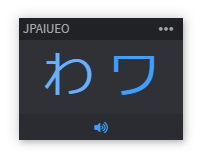
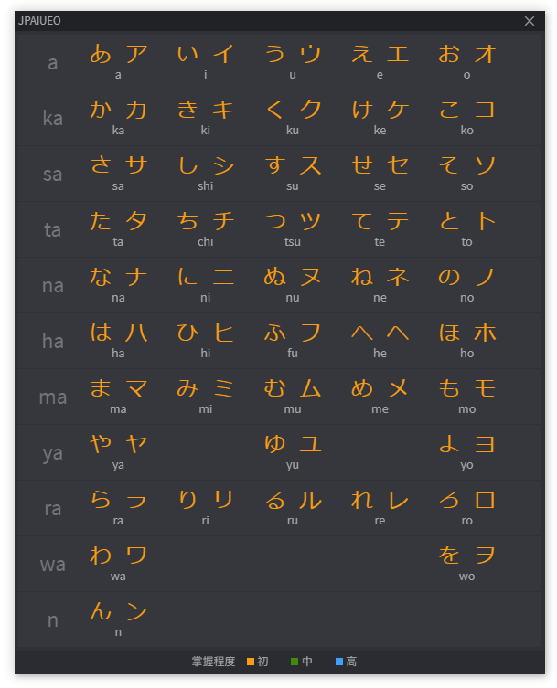

<div align="center">
<br>

<br>
<br>
</div>
<p align="center" color="#6a737d">
<h2 align="center">JPAIUEO</h2>
</p>

<p align="center" color="#6a737d">
固定在桌面顶部浮窗，帮助学习和记忆50音的发音 <br>
Hiragana and Katakana desktop learning tools
</p>

## 功能
### 基本使用
主窗口中会随机显示一组假名，但是不会提示其读法读音，如不知道读音，可点击下方声音按钮了解读音。如已知读音，则点击假名即可随机切换一组新的假名。

### 掌握程度的记录功能
在主窗口切换一组假名，如果点了听语音则说明未掌握，如直接跳过则认为掌握，最终会以三个等级显示在50音图中，清晰标示你掌握和未掌握的音。
> 建议屏蔽平假名或片假名其一进行记忆，否则可能记忆了该假名之一的读音，而认为另一个假名也是掌握的。

## Update
### v0.0.4 `[2018.11.03]`
新增 掌握程度的记录功能  
新增 屏蔽平假名或片假名的设置

## Soft Image  




## Build Setup

``` bash 
# install dependencies
npm install

# serve with hot reload at localhost:9080
npm run dev

# build electron application for production
npm run build

# run unit & end-to-end tests
npm test
```
---

This project was generated with [electron-vue](https://github.com/SimulatedGREG/electron-vue) using [vue-cli](https://github.com/vuejs/vue-cli). Documentation about the original structure can be found [here](https://simulatedgreg.gitbooks.io/electron-vue/content/index.html).
